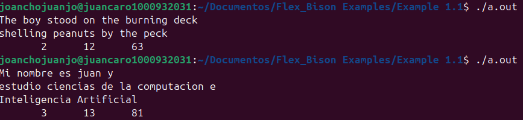

# Taller-Flex-Bison-Juan-Caro

En este taller, se pone a prueba y se profundiza en lo aprendido en el Capítulo 1 del libro Flex & Bison de John Levine, usando Ubuntu en se version 25.05, flex en su versión 2.6.4 y bison en su versión 3.8.2

# Ejemplos

En este espacio, mostraré las salidas para cada uno de los ejemplos (del 1-1 al 1-5) cuyo codígo fuente se puede comprobar en las carpetas adjuntas en este repositorio.

## Ejemplo 1.1

